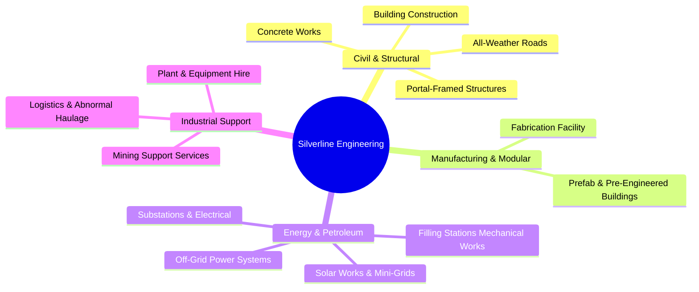
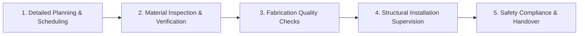
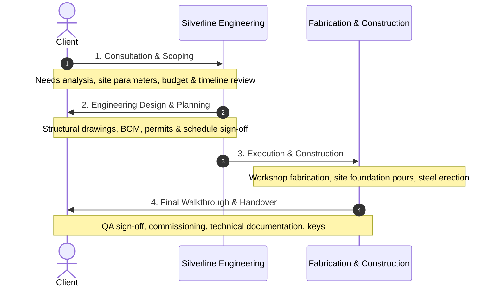

# Silverline Engineering Limited — Comprehensive Company Dossier & Profile

---

## 1. Executive Summary & Company Identity

* **Full Legal Name**: Silverline Engineering Limited (Silverline Engineering Ltd)
* **Company Status**: 100% Zambian-owned Private Limited Engineering & Construction Company
* **Core Specialization**: Civil Engineering, Structural Steel Fabrication, Electrical & Mechanical Works, Solar & Renewable Energy, and Heavy Industrial Infrastructure
* **Headquarters**: Plot 10, Buluwe Street, Woodlands, Lusaka, Zambia
* **Primary Facility**: Industrial Steel Fabrication Facility, Lusaka, Zambia
* **Official Website**: Deployed via Vercel / GitHub (`Abdurazaq8/silverlinewebsite`)
* **Primary Email**: [info@silverlineng.com](mailto:info@silverlineng.com)
* **Direct Phones / WhatsApp**:
  * Line 1: `+260 966 626579` / `0966 626579`
  * Line 2: `+260 771 814040`
* **Operating Hours**:
  * Monday – Friday: `8:00 AM – 5:00 PM`
  * Saturday: `8:00 AM – 1:00 PM`
  * Sunday & Public Holidays: Closed (Emergency site operations on request)

---

## 2. Mission, Vision & Core Values

### Mission Statement
> *"To deliver world-class engineering solutions with integrity, innovation, and professionalism, ensuring client satisfaction through quality workmanship and timely execution."*

### Company Tagline & Value Proposition
* *"Building dreams with precision and excellence. Your trusted partner in steel and concrete construction."*
* *"Engineering Capability Built for Complex Projects."*

### Five Core Values
1. **Quality**: Adherence to rigorous engineering tolerances, international design standards, and premium material specifications.
2. **Safety**: Uncompromising commitment to a zero-harm workplace target, daily site hazard mitigation, and protective protocols.
3. **Integrity**: Full transparency in costing, honest project scheduling, and responsible execution certainty.
4. **Innovation**: Modern CNC precision cutting, laser screed leveling, modular pre-fabrication, and sustainable clean energy solutions.
5. **Professionalism**: Certified structural engineers, registered site supervisors, and seamless collaboration with multinational and institutional clients.

---

## 3. Key Corporate Metrics & Numbers

| Metric | Figure / Capability |
| :--- | :--- |
| **Industry Track Record** | **4+ Years** of hands-on operational excellence across Zambia |
| **Completed Portfolio** | **15+ Projects** completed (10 featured enterprise case studies + ongoing landmarks) |
| **Direct Skilled Workforce** | **50+ Qualified Personnel** (registered engineers, certified welders, machine operators) |
| **Industry Awards** | **3+ Recognition Awards** for technical construction excellence |
| **Client Satisfaction Rate** | **100%** customer handover and operational success rate |
| **Heavy Fabrication Workshop** | **2,500 m²** enclosed structural manufacturing facility in Lusaka |
| **Prefabrication Production Line**| **2,000 m²** dedicated production line for modular pre-fabricated units |
| **Service Categories** | **8 Principal Divisions** / **12 Specialized Service Lines** |

---

## 4. Engineering Infrastructure & Manufacturing Facilities

Silverline Engineering operates integrated fabrication and manufacturing infrastructure in Lusaka engineered for high-tonnage structural output:

### Heavy Fabrication Workshop (2,500 m²)
* Designed to support high-tonnage structural steel manufacturing, column fabrication, portal frames, trusses, and industrial plate work.
* Equipped with **overhead travelling cranes** for heavy structural handling, assembly, and truck loading.
* Enclosed fabrication bays with multi-point three-phase power reticulation.

### Prefabricated Production Line (2,000 m²)
* Dedicated modular manufacturing line for pre-engineered buildings, modular site camps, worker housing, and containerized technical units.
* High speed assembly jigs enabling accelerated project turnarounds.

### Machinery & Automated Tooling
1. **Automated CNC Machinery**: Precision computer numerical control cutting, drilling, and profiling.
2. **High-Definition Plasma Cutting Systems**: Intricate plate profiling, gusset fabrication, and base plate manufacturing.
3. **Heavy Sheet & Pipe Rolling Machines**: Cylindrical shell rolling, tank wall fabrication, and curved structural sections.
4. **Multiple Industrial Welding Stations**: MMAW, MIG/MAG, and TIG welding bays certified for high-stress structural connections.
5. **Heavy Fleet & Earthmoving Machinery Rental**:
   * Articulated Dump Trucks (ADT)
   * Heavy Bulldozers & Graders
   * Hydraulic Excavators & Front-end Loaders
   * High-capacity Water Bowsers and compaction rollers

---

## 5. Comprehensive Service Lines (12 Core Offerings)



### 1. Plant & Equipment Hire
* Reliable heavy machinery rental for earthworks, road construction, and industrial leveling.
* Fleet includes ADT dump trucks, tracked dozers, excavators, compaction rollers, and water bowsers.

### 2. Logistics & Transportation
* Specialized industrial transport and heavy haulage across all provinces in Zambia.
* Abnormal load haulage, oversized structural truss movement, and cross-border project freight logistics.

### 3. Prefab & Pre-Engineered Buildings
* Turnkey supply and erection of prefab housing, temporary site offices, clinic units, and pre-engineered warehouses.
* Provides rapid assembly, thermal insulation, and long-term durability in remote settings.

### 4. Mining Support Services
* Mining infrastructure development in the Copperbelt and North-Western provinces.
* Supply of specialized civil foundations, plant equipment, conveyor supports, and site drainage.

### 5. Building Construction
* Turnkey construction of multi-story residential developments, commercial malls, corporate offices, and institutions.
* Strict architectural compliance, quality masonry, reinforced concrete, and modern facade finishes.

### 6. Portal-Framed Structures Fabrication & Erection
* Complete design, factory fabrication, transport, and site erection of portal-framed steel buildings.
* Ideal for warehouses, factories, grain storage hubs, and agricultural processing facilities.

### 7. Concrete Works
* Advanced reinforced concrete design and pouring: raft foundations, suspended slabs, deep equipment plinths, heavy retaining walls, and columns.
* Precision laser screed leveling, vibration control, and high-strength mix designs.

### 8. All-Weather Roads Construction
* Construction of gravel and rigid concrete paved access roads designed for heavy transport.
* Earthworks, subgrade stabilization, cement-stabilized base course, culverts, and trapezoidal side drainage.

### 9. Off-Grid Power Construction
* Civil and electrical development of decentralized mini-grids and power installations in off-grid rural and industrial areas.
* Battery Energy Storage System (BESS) enclosures, transformer yards, and perimeter civil works.

### 10. Electrical Substations Construction
* Civil and structural works for medium and high-voltage electrical substations.
* Transformer foundations, vibration-dampened plinths, blast walls, concrete cable trenches, and gantry steelwork.

### 11. Filling Stations Mechanical Works
* Turnkey petroleum retail engineering: underground double-walled fuel tank excavation, anchoring, and pressure testing.
* Structural canopy fabrication, suction and vent pipe installations, dispenser islands, and ERB-compliant fuel containment.

### 12. Solar Works & Solar Farms
* Complete photovoltaic (PV) solar installations: driven pile and ground-mount racking, module strings, inverters, battery banks, and lightning protection.
* Executed in commercial, institutional, and rural utility settings.

---

## 6. Workforce & Team Structure

Silverline’s team structure merges technical theory with on-site construction discipline:

```
┌─────────────────────────────────────────────────────────────┐
│                       EXECUTIVE LEADERSHIP                  │
├─────────────────────────────────────────────────────────────┤
│                                                             │
│  ┌────────────────────────┐      ┌────────────────────────┐ │
│  │ Engineering Division   │      │ Fabrication & Workshop │ │
│  │ Registered Structural  │      │ Certified Welders, CNC │ │
│  │ & Civil Engineers      │      │ Machinists & Fitters   │ │
│  └───────────┬────────────┘      └───────────┬────────────┘ │
│              │                               │              │
│  ┌───────────▼────────────┐      ┌───────────▼────────────┐ │
│  │ Site Operations & PMs  │      │ Health, Safety & QC    │ │
│  │ Dedicated Supervisors, │      │ Safety Officers, QA/QC │ │
│  │ Planners & Surveyors   │      │ Material Inspectors    │ │
│  └────────────────────────┘      └────────────────────────┘ │
└─────────────────────────────────────────────────────────────┘
```

1. **Experienced Engineering Team**: Registered structural and civil engineers guiding design integrity, calculations, structural modeling, and statutory council submissions.
2. **Skilled Fabricators & Technicians**: Certified welders (coded), CNC operators, machine fitters, and structural steel erectors delivering millimeter-level tolerance.
3. **Dedicated Site Supervisors & Project Managers**: Full-time site managers enforcing milestone schedules, daily contractor logs, material logistics, and quality hold-points.
4. **Safety-Focused Operational Teams**: On-site safety officers enforcing daily toolbox talks, hazard identification, and Zero-Harm protocols.

---

## 7. Quality Control, Safety & Statutory Compliance

### Structured 5-Step Quality Assurance Procedure

1. **Detailed Project Planning & Scheduling**: Gantt chart milestones, critical path tracking, and risk contingency buffers.
2. **Material Inspection & Verification**: Mill test certificates, steel grade checks, rebar tensile testing, and concrete cube compressive tests.
3. **Fabrication Quality Checks**: Weld penetration inspection, dimensional verification of trusses and columns, surface blast cleaning, and anti-corrosion primer application.
4. **Structural Installation Supervision**: Torque testing on structural high-tensile bolts, laser alignment of columns, and plumb verification.
5. **Safety Compliance and Site Management**: Zero workplace incidents policy, daily job safety analyses (JSA), and regulatory sign-offs.

### Regulatory Accreditations & Statutory Compliance
* **National Council for Construction (NCC)**: Accredited civil and structural contractor in Zambia.
* **Engineering Institution of Zambia (EIZ)**: Corporate and professional engineering registration.
* **Workers’ Compensation Fund Control Board (WCFCB)**: Full statutory occupational coverage and safety compliance.
* **Zambia Revenue Authority (ZRA)**: Fully registered with active, compliant Tax Clearance Certification.
* **National Pension Scheme Authority (NAPSA)**: 100% compliant statutory pension contributions for all workforce tiers.
* **ISO Quality Management Systems**: Quality management system certification currently in progress.

---

## 8. Four-Stage Project Delivery Process



1. **Consultation**: Initial technical scoping, site appraisal, budget alignment, and client specification review.
2. **Design & Planning**: Engineering drafting, structural calculations, local authority permitting, and material procurement scheduling.
3. **Construction**: Factory pre-fabrication, on-site civil and concrete pouring, structural steel framing, mechanical fittings, and regular milestone reporting.
4. **Project Handover**: Comprehensive QA inspection, defect-free snag list resolution, technical documentation handover, and client key transfer.

---

## 9. Complete Project Portfolio (All 11 Case Studies)

```
[●] ACTIVE / ONGOING: 1 Project (Ndeke Mosque)
[✓] COMPLETED: 10 Projects
```

### Detailed Breakdown of Every Project

#### 1. East Park Mall Expansion
* **Sector**: Commercial
* **Location**: Lusaka, Zambia
* **Client**: Napoli Property
* **Timeline**: 2023 – Present
* **Status**: `COMPLETED`
* **Overview**: Prestigious commercial expansion at Zambia's premier retail destination, East Park Mall. Silverline executed structural additions, reinforced concrete suspended slabs, and modern retail infrastructure while the shopping center remained fully operational to thousands of daily shoppers.
* **Scope**: Structural steel framing and extension; reinforced concrete suspended slabs & foundations; commercial perimeter enclosure & modern facades; site drainage reticulation; pedestrian protection.
* **Key Achievements**: Zero incidents recorded in live retail environment; seamless match to existing architectural facades.
* **Testimonial**: *"The team delivered the East Park Mall expansion works with professionalism, strong communication, and careful site management... We are very pleased with the quality of the completed works."* — **Gillian Casilli**, Napoli Property.

---

#### 2. Meco Milling Plant
* **Sector**: Industrial
* **Location**: Ndola, Copperbelt Province
* **Client**: Eco Petroleum / Meco Milling
* **Timeline**: 2023 – 2024
* **Status**: `COMPLETED`
* **Overview**: Turnkey civil and structural engineering for a high-capacity 150 Ton/day commercial maize milling facility. Includes industrial portal-frame warehouses, administrative offices, high-voltage transformer substation, silo foundations, and heavy logistics yards.
* **Scope**: 150 Ton/day industrial milling structure; vibration-dampened heavy equipment foundations; portal-framed warehouses; electrical substation; weighbridge & paved logistics aprons.
* **Key Achievements**: Fully operational supporting the Copperbelt food supply chain; extreme floor durability under multi-ton vibrating loads.
* **Testimonial**: *"Both projects were completed to a high standard, with the milling plant now fully operational. Throughout both projects, the team was professional, responsive, and easy to work with."* — **Hussein Mohamed Ahmed**, Eco Petroleum.

---

#### 3. UNDP Bulking Centers (SCLARA Drought Mitigation)
* **Sector**: Industrial / Humanitarian Infrastructure
* **Location**: Eastern & Western Provinces, Zambia
* **Client**: United Nations Development Programme (UNDP)
* **Timeline**: 2023 – 2024
* **Status**: `COMPLETED`
* **Overview**: Construction of four large portal-framed regional agricultural bulking and storage centers under the SCLARA drought mitigation project to protect crop yields and provide food security in climate-vulnerable zones.
* **Scope**: Four heavy-duty portal-framed steel bulking centers; engineered concrete floor slabs for massive grain storage; all-weather truck loading bays; rainwater harvesting; solar security lighting; remote logistics.
* **Key Achievements**: Delivered across rugged remote provincial zones; complied with rigorous UN environmental and social safeguards.
* **Testimonial**: *"The team successfully constructed four portal-framed bulking centers... They worked professionally and adapted well to the challenges of delivering projects in remote locations."* — **Patrick Muchimba**, UNDP.

---

#### 4. Ndeke Mosque *(⭐ The Sole Active Project)*
* **Sector**: Religious / Community Landmark
* **Location**: Ndeke, Ndola, Copperbelt Province
* **Client**: Islamic Community Ndola
* **Timeline**: 2023 – Present
* **Status**: `ACTIVE / ONGOING`
* **Overview**: Iconic community landmark featuring double-volume reinforced concrete framing, raft foundations, expansive mezzanine prayer halls, architectural domes, and specialized acoustic and ventilation detailing.
* **Scope**: Heavy raft foundation engineering; double-volume reinforced concrete arches, columns, and beams; mezzanine prayer gallery; dome structural ring engineering; integrated ablution facilities and civil plumbing.
* **Key Achievements**: High-difficulty structural arch formwork; thermal passive ventilation and massive congregation capacity.

---

#### 5. Oryx Munali Filling Station
* **Sector**: Commercial / Petroleum Retail
* **Location**: Munali, Lusaka, Zambia
* **Client**: Oryx Energies
* **Timeline**: 2023 – 2024
* **Status**: `COMPLETED`
* **Overview**: Turnkey rehabilitation and modern rebranding of the Oryx Munali retail petroleum station. Included canopy structural fabrication, underground double-wall tank installation, forecourt concrete paving, and retail convenience store fit-out.
* **Scope**: Forecourt canopy fabrication; double-walled underground tank installation and pressure testing; heavy forecourt concrete paving; retail convenience store; hazardous area electrical interlocks.
* **Key Achievements**: Delivered on time with strict international petroleum safety compliance; smooth transition to daily fuel operations.
* **Testimonial**: *"They handled the renovation of the canopy and the shop rebranding with professionalism and attention to detail. Our experience was smooth and positive."* — **Kayamba Kayamba**, Oryx Energy.

---

#### 6. Alix Investment Ltd Factory
* **Sector**: Industrial
* **Location**: Lusaka South Multi-Facility Economic Zone (LSMFEZ), Lusaka
* **Client**: Alix Investment Ltd
* **Timeline**: 2023 – 2024
* **Status**: `COMPLETED`
* **Overview**: Large manufacturing and warehousing hub development within the Special Economic Zone. Included 1,800m² and 1,250m² high-bay portal-framed warehouses, industrial oil storage tank bases, boundary civil works, and logistics circulation pavements.
* **Scope**: 1,800m² and 1,250m² steel portal frames; heavy reinforced concrete oil tank foundations; laser-screeded industrial floor slabs; administrative office blocks; heavy transport arterial roads.
* **Key Achievements**: Over 3,000m² of covered industrial production space created in compliance with international export processing standards.

---

#### 7. Eco Petroleum Chalala
* **Sector**: Commercial / Petroleum Retail
* **Location**: Chalala, Lusaka, Zambia
* **Client**: Eco Petroleum
* **Timeline**: 2023 – 2024
* **Status**: `COMPLETED`
* **Overview**: Greenfield development and subsequent acquisition retrofit of the Eco Petroleum filling station along the high-traffic Chalala corridor. Included forecourt civil works, canopy structural steel fabrication, convenience store, warehouse, and fuel-resistant concrete slabs.
* **Scope**: Forecourt canopy fabrication and cladding; underground fuel lines and dispenser islands; retail shop and warehouse facility; heavy concrete pavement; oil-water separators and environmental containment.
* **Key Achievements**: Full environmental and fire safety certification achieved; high commuter vehicle traffic capacity.

---

#### 8. Limulunga Day Secondary School
* **Sector**: Institutional / Educational
* **Location**: Limulunga, Western Province, Zambia
* **Client**: Ministry of Education
* **Timeline**: 2023 – Present (Works Completed)
* **Status**: `COMPLETED`
* **Overview**: Comprehensive educational infrastructure completion serving hundreds of students. Scope included classroom wings, administrative offices, science laboratories, decentralized sewer treatment systems, borehole water reticulation with elevated tanks, and sports courts.
* **Scope**: Multiple classroom blocks and science labs; complete water reticulation with borehole and elevated tanks; on-site sanitary sewer system; multi-purpose sports courts; electrical grid connection and security fencing.
* **Key Achievements**: Self-sufficient water and sanitation infrastructure built in Western Province; massive social and educational impact.

---

#### 9. Afro Oil Filling Station
* **Sector**: Commercial / Petroleum Retail
* **Location**: New Kasama, Lusaka, Zambia
* **Client**: Afro Oil Zambia
* **Timeline**: 2023 – 2024
* **Status**: `COMPLETED`
* **Overview**: Turnkey engineering, civil excavation, and mechanical installation of a high-end commercial fuel station in New Kasama. Featured advanced fiber-coated double-wall underground fuel tanks, fuel delivery piping, electrical containment, canopy, and retail building.
* **Scope**: Deep excavation and shoring; fiber-coated fuel storage tanks installation; cathodic protection & leak monitoring; structural steel canopy; cast-in-place concrete forecourt; corporate retail storefront.
* **Key Achievements**: Advanced anti-corrosion tank technology deployed; full compliance with Energy Regulation Board (ERB) standards.

---

#### 10. Victoria Falls Road
* **Sector**: Infrastructure / Civil Transport
* **Location**: Livingstone, Southern Province, Zambia
* **Client**: Road Development Agency (RDA) / Livingstone Municipality
* **Timeline**: 2023 – 2024
* **Status**: `COMPLETED`
* **Overview**: Heavy-duty road infrastructure facilitating vital tourist and commercial access to the Victoria Falls World Heritage area in Livingstone. Included subgrade grading, cement-stabilized crushed stone base layer compaction, reinforced concrete rigid pavement, and drainage.
* **Scope**: Earthworks, subgrade preparation, and leveling; cement-stabilized base course; high-strength reinforced rigid concrete pavement; trapezoidal stormwater drains and culverts; pedestrian walkways and road markings.
* **Key Achievements**: High durability concrete pavement resisting heavy tourist coach loads and high seasonal temperatures.

---

#### 11. Engic Solar Plants (Mini-Grids)
* **Sector**: Energy / Renewable Infrastructure
* **Location**: Multiple sites across Eastern Province, Zambia
* **Client**: Engie Energy Access / Rural Electrification Authority
* **Timeline**: 2023 – 2024
* **Status**: `COMPLETED`
* **Overview**: Installation of decentralized solar mini-grid power plants across multiple rural communities in Eastern Province. Works included driven-pile steel mounting frames, photovoltaic panel strings, inverter stations, Battery Energy Storage Systems (BESS), and security perimeters.
* **Scope**: Ground-mount racking structure assembly; multi-kilowatt solar panel array strings; climate-controlled battery housing; inverter & switchgear integration; security fencing and lightning earthing.
* **Key Achievements**: Clean, continuous, zero-emission electricity delivered to off-grid rural clinics, schools, and domestic households.

---

## 10. Key Clients & Institutional Partners

* **Multilateral & Governmental**:
  * United Nations Development Programme (UNDP)
  * Ministry of Education (Republic of Zambia)
  * Road Development Agency (RDA) / Livingstone Municipality
  * Zambia Revenue Authority (ZRA)
* **Commercial Retail & Property**:
  * Napoli Property (East Park Mall)
  * Real Estate Investments Zambia (REIZ)
  * Alix Investment Ltd (LSMFEZ)
* **Petroleum & Energy Operators**:
  * Oryx Energies
  * Eco Petroleum / Meco Milling
  * Afro Oil Zambia
  * Engie PowerCorner / Engie Energy Access
* **Automotive & Specialized Services**:
  * Khalif Motors

---

## 11. Official Contact & Tender Engagement Information

| Contact Channel | Official Detail |
| :--- | :--- |
| **Physical Address** | Plot 10, Buluwe Street, Woodlands, Lusaka, Zambia |
| **Fabrication Facility** | Heavy Industrial Area, Lusaka, Zambia |
| **General Email** | [info@silverlineng.com](mailto:info@silverlineng.com) |
| **Direct Phone Calls** | `+260 966 626579` / `0966 626579` |
| **WhatsApp Chat Line 1** | [Chat on WhatsApp (+260 966 626579)](https://wa.me/260966626579) |
| **WhatsApp Chat Line 2** | [Chat on WhatsApp (+260 771 814040)](https://wa.me/260771814040) |
| **Facebook Page** | [Silverline Engineering on Facebook](https://www.facebook.com/share/1KntzJukRd/?mibextid=wwXIfr) |
| **Instagram Page** | [@silverline.eng_limited](https://www.instagram.com/silverline.eng_limited?stkn=aGtib2tuc2hvNW5w) |
| **LinkedIn Company Page**| [Silverline Engineering Limited](https://www.linkedin.com/company/silverline-engineering-limited) |
| **Business Working Hours**| Monday – Friday: 08:00 – 17:00 \| Saturday: 08:00 – 13:00 |

---
*Dossier prepared and verified against the official Silverline Engineering Limited technical repository.*
